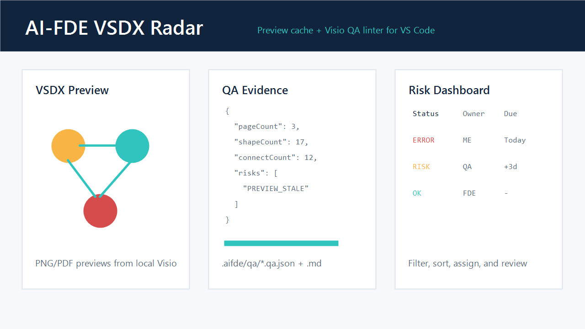

# Visio Preview & QA Linter

一个面向科研绘图和项目制图场景的 VS Code 插件：可以在 VS Code 中直接预览、轻量编辑和检查 Microsoft Visio 文件。现代 Visio 包格式（`.vsdx`、`.vsdm`、`.vssx`、`.vssm`、`.vstx`、`.vstm`）和 Visio XML 格式（`.vdx`、`.vsx`、`.vtx`）走语义预览与轻量编辑路径；旧二进制/旧容器格式（`.vsd`、`.vss`、`.vst`、`.vdw`、`.vwi`、`.vsw`）会被识别，并提供显式转换为现代 Visio 包的入口。它的初衷很简单：让科研工作者、研究生、工程研究人员和需要频繁画图改图的人，不必每次都在编辑器、文件夹和 Visio 之间来回切换，也能把预览、结构检查和交付证据放进同一个工作流里。

这个项目由我个人维护。如果你在科研研究、论文配图、项目汇报、架构图、流程图或 Visio 文件协作中遇到任何问题，或者希望它支持新的能力，欢迎直接到 [GitHub Issues](https://github.com/ueacdyy-sys/ai-fde-vsdx-radar/issues) 提反馈和需求。只要不是特别重的功能，我都会尽量推进。也可以通过邮件联系我：`ueacdyy@gmail.com`。如果这个插件对你有帮助，也欢迎在 GitHub 上给一个 Star，这会让我更容易判断大家真正需要什么。

Visio Preview & QA Linter brings modern Microsoft Visio package review into VS Code: interactive preview, lightweight edits, local preview export, diagram QA, and review evidence without leaving the editor.



## What It Does

- Opens modern Visio package files (`.vsdx`, `.vsdm`, `.vssx`, `.vssm`, `.vstx`, `.vstm`) and Visio XML files (`.vdx`, `.vsx`, `.vtx`) with an interactive custom editor in VS Code.
- Supports zoom, page switching, shape dragging, direct shape resizing, connector endpoint dragging, and lightweight text edits for supported shapes.
- Handles editable shapes and connectors inside Visio groups by writing edits back to the correct local group coordinates, including Visio XML files.
- Keeps simple rotated and flipped shapes editable: they render with their stored `Angle`, `FlipX`, and `FlipY` transforms, can be dragged or text-edited, and preserve `Angle` on save.
- Resolves Visio StyleSheet and master-shape inheritance for hand-authored files, so fill, patterned fill background, line, stroke width, line cap, line rounding, dashed line patterns, connector arrow, arrow size, shadow color, shadow blur, Geometry section paint visibility, and basic text style semantics render on the fast XML/ZIP path.
- Renders connector direction, line transparency, and line semantics from Visio `BeginArrow`, `EndArrow`, `LineColorTrans`, and `LinePattern` cells, including modern package and legacy Visio XML files.
- Renders basic text formatting from Visio `Color`, `Font`, `Size`, `Character.Style`, `Strikethru`, paragraph alignment, bullet text position, TextBlock margins, `TextBkgnd`, and `TextBkgndTrans` cells, including inherited formatting from styles and legacy Visio XML files.
- Renders embedded pictures from page relationships, master relationships, and inline Visio XML image data when the file already carries that semantic image payload.
- Exports Visio files to cached PNG or PDF previews through local Microsoft Visio automation.
- Supports multi-page diagrams with one preview per page.
- Parses modern Visio package XML and Visio XML drawings, then writes `.aifde/qa/*.qa.json` plus `.qa.md` summaries.
- Recognizes legacy binary and opaque Visio files (`.vsd`, `.vss`, `.vst`, `.vdw`, `.vwi`, `.vsw`) and adds an explicit conversion command so they can become modern package files (`.vsdx`, `.vssx`, `.vstx`) before entering semantic QA and lightweight editing.
- Includes all recognized Visio extensions in workspace reports and the risk dashboard; legacy files are marked as `LEGACY_CONVERSION_REQUIRED` and expose a conversion action instead of failing silently.
- Flags common delivery risks: missing or stale previews, empty pages, duplicate Shape IDs, unlabeled shapes, low connector ratio, diagonal connectors, connectors crossing nodes, dangling connectors, overlapping shapes, page coverage issues, and out-of-bounds shapes.
- Adds Explorer context menu commands for preview, QA, status, and artifact reveal actions.
- Generates workspace reports, risk reports, due-risk reports, team review boards, calendar exports, and a webview dashboard for filtering and assigning diagram risks.
- Supports QA profile templates, import/export, config diff, profile stacks, and profile audit history.

## Requirements

- VS Code 1.90 or newer.
- Windows with PowerShell 7.6.2 available as `pwsh`.
- Microsoft Visio for Windows with a usable local license for high-fidelity preview export.
- Local filesystem workspace; virtual and untrusted workspaces are intentionally disabled.

The QA linter reads modern Visio package XML and Visio XML drawings locally. High-fidelity preview export and explicit legacy conversion require Visio COM automation. Legacy binary and opaque Visio files can be recognized, but semantic QA and lightweight editing require conversion to a modern Visio package first.

## Quick Start

1. Open a workspace containing modern Visio package files.
2. Open a `.vsdx`, `.vsdm`, `.vssx`, `.vssm`, `.vstx`, `.vstm`, `.vdx`, `.vsx`, or `.vtx` file directly. The extension opens the interactive Visio editor by default.
3. Use the toolbar to switch pages, zoom, save, reveal the source file, or open settings.
4. Drag supported shapes or connector endpoints, or edit text from the side panel.
5. Run `AI-FDE: Export Preview and QA` when you need cached PNG/PDF previews and QA evidence.
6. For legacy `.vsd`, `.vss`, `.vst`, `.vdw`, `.vwi`, or `.vsw` files, run `AI-FDE: 转换旧 Visio 为现代格式 / Convert Legacy Visio to Modern Package` first. The converted file is written beside the source as `*.converted.*` without overwriting existing files, then opened in the interactive editor.

Useful commands:

- `AI-FDE: 打开 VSDX 交互预览 / Open Interactive VSDX Editor`
- `AI-FDE: 转换旧 Visio 为现代格式 / Convert Legacy Visio to Modern Package`
- `AI-FDE: Export Preview and QA`
- `AI-FDE: Open VSDX Preview`
- `AI-FDE: Open All VSDX Previews`
- `AI-FDE: Open VSDX QA Report`
- `AI-FDE: Show VSDX Status`
- `AI-FDE: Reveal VSDX Artifacts`
- `AI-FDE: Generate Workspace VSDX Report`
- `AI-FDE: Generate Workspace VSDX Risk Report`
- `AI-FDE: Open Workspace VSDX Risk Dashboard`
- `AI-FDE: Generate VSDX Demo Pack`

## Output Layout

```bash +code
.aifde/
  previews/                # PNG/PDF preview cache
  qa/                      # Per-file QA JSON and Markdown summaries
  reports/                 # Workspace, risk, team, config, and demo reports
  acceptance/              # Local release acceptance reports
  cache-index.json         # Preview freshness and QA cache metadata
```

## QA Evidence

Each QA JSON report includes:

- Source path and source modified time.
- Preview path, preview freshness state, and freshness reasons.
- Page, shape, text shape, unlabeled shape, connector, route, crossing, overlap, and coverage statistics.
- Risk list with severity, code, page, and message.

The Markdown summary mirrors the same evidence for human review.

## Dashboard And Reports

The workspace dashboard helps teams triage diagram delivery risk:

- Filter by status, risk code, preview freshness reason, owner, processing status, and keyword.
- Sort by priority, due date, owner, status, or file name.
- Assign owner, due date, processing state, and remediation notes.
- Export due-risk items to an `.ics` calendar file.
- Generate team-board reports for standups or design reviews.

## Configuration

| Setting | Default | Description |
| ------- | ------- | ----------- |
| `aiFdeVsdxRadar.pwshPath` | `pwsh` | PowerShell 7.6.2 executable path. |
| `aiFdeVsdxRadar.outputDirectory` | `.aifde` | Workspace-relative artifact directory. |
| `aiFdeVsdxRadar.previewFormat` | `png` | Preview format: `png` or `pdf`. |
| `aiFdeVsdxRadar.qaPreset` | `custom` | QA preset: `custom`, `balanced`, `strict`, or `quiet`. |
| `aiFdeVsdxRadar.autoExportOnSave` | `false` | Automatically export preview and QA when supported modern Visio package files change. |
| `aiFdeVsdxRadar.exportTimeoutMs` | `120000` | Visio export timeout in milliseconds. |
| `aiFdeVsdxRadar.convertTimeoutMs` | `300000` | Explicit legacy Visio conversion timeout in milliseconds. |

Additional settings expose QA thresholds and switches for shape density, connector ratio, unlabeled shapes, page coverage, diagonal connectors, connector crossings, dangling connectors, and shape overlap checks.

## Local Verification

```bash +code
npm install
npm run marketplace:assets
npm run marketplace:check
npm run verify
npm run smoke:visio:convert
npm run qa:evidence
npm run demo:pack
npm run demo:pack:check:strict
npm run package
```

Full local release gate:

```bash +code
npm run acceptance
```

The acceptance gate verifies manifest contributions, QA fixtures, single-page and multi-page Visio export, real Visio QA smoke tests, QA evidence generation, VSIX packaging, local VSIX installation, and strict Demo Pack freshness.

## Marketplace Publishing

The proposed extension ID is:

```bash +code
ai-fde-lab.ai-fde-vsdx-radar
```

Before publishing, confirm the final Marketplace publisher ID and GitHub repository. If they differ, update `publisher`, `repository`, `bugs`, and `homepage` in `package.json`, then rerun:

```bash +code
npm run marketplace:check
npm run acceptance
```

See `docs/publishing.md` for the release checklist.

## Feedback And Contact

This is a personal-maintained project for people who want a more convenient Visio and research-diagram workflow inside VS Code. Feedback, bug reports, and feature requests are very welcome:

- GitHub Issues: <https://github.com/ueacdyy-sys/ai-fde-vsdx-radar/issues>
- Email: `ueacdyy@gmail.com`
- GitHub Star: <https://github.com/ueacdyy-sys/ai-fde-vsdx-radar>

## Limitations

- Preview export is Windows-only because it uses local Visio COM automation.
- Legacy conversion is explicit and may be slow because it launches local Microsoft Visio; it is intentionally not run during normal file open.
- QA rules are structural and heuristic; they complement but do not replace human diagram review.
- This first public release is marked as Preview in the Marketplace.
